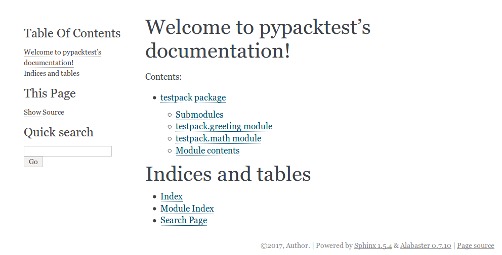

This document shows readers how to build their own python packages from the very scratch up to the registration to PyPI (Python Package Index).
Mainly developed on `Python 3.5.2` with `pip 9.0.1`, and `setuptools 27.2.0`.


## Simplest package

Consider a folder as below:

```
pypacktest/
    setup.py
    testpack/
        __init__.py
        greeting.py
```

Surprisingly, this is already a package!  
If we write appropriate codes in `setup.py`, then we can install this using `pip` command.

And here is the minimal `setup.py`.

*setup.py*

```python
# -*- coding: utf-8 -*-

from setuptools import setup, find_packages

setup(
    name='testpack',
    version='0.1',
    packages=find_packages()
)
```

First, we import `setup` function from `setuptools` module. 
`setup` function does most of the job for us; it puts together packages provided that we give an appropriate scripts.
`find_packages` function, which also comes from `setuptools` module, is a helpful function that finds package folders under the directory tree.  In this application, the function detects `testpack/` folder since it is the only folder that has `__init__.py` (As a rule, folders with `__init__.py` file are regarded as a package.)
Hence, we can also write `packages=["testpack"]`.  If we have a lot of packages within the tree, then `find_packages` function reduces our writing.

Now let's take a look at our only module, `greeting.py`.

*greeting.py*

```python
# -*- coding: utf-8 -*-

def say_hello():
    print("Hello!")
```

So, `greeting` module has only one function named `say_hello`, which prints a message "Hello!" on the console.

Finally, `__init__.py` file is an empty text file.


Okay, now we are ready to install this package to python.
At the `testpack/` folder, run the following command:

```bash
$ pip install -U .
```

`.` indicates that the package to install is located at the current folder.  You can also move one folder up and run `pip install -U ./pypacktest`.

The option `-U` forces to upgrade the package, whether or not you already have the latest version.  This is useful for our experiments since we make slight changes in our source code and see differences resulted from them.  If we omit `-U` option, then `pip` will skip installation saying "Requirement already satisfied".

If the above command runs successfully, then `testpack` should already be installed in python.  To confirm this, run:

```bash
$ pip list --format columns
```

In my environment, I get the following result.  Yes! `testpack ver0.1` is installed!

```
Package    Version
---------- -------
pip        9.0.1  
setuptools 27.2.0 
testpack   0.1    
wheel      0.29.0 
```

We can now use `testpack` package and functions therein like other packages.  One caution is that we need to import `testpack.greeting`, not just `testpack`.  To see this, run the followings on the terminal.  Note that the option `-c` lets you type in python commands without starting a python session.

```bash
$ python -c "import testpack.greeting; testpack.greeting.say_hello()"
Hello!
```
The message "Hello!" is printed as desired.  However,

```bash
$ python -c "import testpack; testpack.greeting.say_hello()"
Traceback (most recent call last):
  File "<string>", line 1, in <module>
AttributeError: module 'testpack' has no attribute 'greeting'
```

I don't know exactly why, but this may be same as `urllib` versus `urllib.request`.

In any case, we have successfully build an original package locally on Python.


## Edit `__init__.py`

We can leave `__init__.py` file empty.  The most important job of this file is to tell python that the folder is a package.
But it can do other jobs too.

When a package is imported, `__init__.py` is run. To see this, let's edit the file as follows.

*\_\_init\_\_.py*

```python
print('I count ten:', end=' ')
for i in range(1, 11):
    print(i, end=' ')
print()
```
This code prints numbers from 1 to 10.
Run `pip install -U .` and then,

```bash
$ python -c "import testpack"
I count ten: 1 2 3 4 5 6 7 8 9 10
```
Note that you should run this somewhere other than `pypacktest/`.  If you run this at `pypacktest/`, then python would import the local folder instead of the installed package.

As expected, numbers are printed when `testpack` package is imported.  Note this happens only for once.  The script is not run for the second import.

```bash
$ python -c "import testpack; import testpack"
I count ten: 1 2 3 4 5 6 7 8 9 10
```

Of course, we can let the file do more useful things than printing numbers.  An important application is to associate functions directly to the package.  Currently, our `say_hello` function is accessed by `testpack.greeting.say_hello`.  This is a lot of writing.  It could be better in users can use the function by `testpack.say_hello`.  We can do this using `__init__.py`.

Edit `__init__.py` as follows:

*\_\_init\_\_.py*

```python
from .greeting import say_hello
```

This says, when `testpack` is imported, the function `say_hello` is fetched to directly under `testpack` namespace (I am not sure if this terminology is correct, though).

We can do the following now (don't forget to run `pip install -U .`):
```bash
$ python -c "import testpack; testpack.say_hello()"
Hello!
```

I find this quite useful, particularly to fetch package's core functionalities (functions or classes) directly under the package name.
For example (if you have `pandas` package installed), we can see that `pandas.Series` is actually located deep inside the package tree.

```bash
$ python -c "import pandas; x = pandas.Series([1,2,3]); print(type(x))"
<class 'pandas.core.series.Series'>
```

## Specify Dependencies

Unless you are a super programmer who can write everything by your own, your package will rely on other people's works.
If this is the case, we should specify packages on which your package depends on in the `setup.py` file.
If we do so, `pip` will install them automatically (if they are not installed yet) before installing our package.  

Note that this section covers dependencies on packages on PyPI.  
Dependencies on packages not available on PyPI is covered in a later section.

The following example shows a setup file for a package that depends on `numpy`.
The dependencies are given as a string list to `install_requires` field.

*setup.py*

```python
# -*- coding: utf-8 -*-

from setuptools import setup, find_packages

setup(
    name='testpack',
    version='0.1',
    packages=find_packages(),
    
    install_requires=[ 
        "numpy"
    ]
)
```

Let's make a function that uses `numpy`.
Add another script file (module) named "math.py" to the `testpack/` folder.

*math.py*

```python
# -*- coding: utf-8 -*-

import numpy as np

def sumproduct(x, y):
    return np.dot(np.array(x), np.array(y))
```

`sumproduct` function computes the weighted sum of two vectors `x` and `y`. 

As a result, our folder structure is as below.

```
pypacktest/
    setup.py
    testpack/
        __init__.py
        greeting.py
        math.py
```


Run `pip install -U .`, and run the following command:

```bash
$ python -c "import testpack.math; print(testpack.math.sumproduct([1,2,3], [4,5,6]))"
32
```

As expected, we obtain `32 (=1*4 + 2*5 + 3*6)`.

If the package depends on specific versions of other packages, say numpy v.1 or later, then we can be more specific in the `setup.py` file like: `numpy>=1`.


## Include and Use Data Files

We may want to include data files within our package.  To do so, we simply locate files somewhere in the package tree, and then express our intention to include them in the `setup.py`.  If we omit that, then `pip` would ignore files not with `.py` extention.

Let us start with a simple example.  Add a text file as below in the `testpack/` folder.

*wilde.txt*
```
Life is too important to be taken seriously.
```

Our folder structure is now:
```
pypacktest/
    setup.py
    testpack/
        __init__.py
        greeting.py
        math.py
        wilde.txt
```

Edit `setup.py` file as below:

*setup.py*
```python
# -*- coding: utf-8 -*-

from setuptools import setup, find_packages

setup(
    name='testpack',
    version='0.1',
    packages=find_packages(),

    install_requires=[
        "numpy"
    ],
    package_data={
        'testpack': ['wilde.txt']
    }
)
```

`package_data` option is a dictionary that maps from package names to a set of data files.  This particular example states that `testpack/` package includes the file `wilde.txt`.
The reason why we specify the package name that include the file is because a package may be a bundle of several packages (Recall that all folders with `__init__.py` are packages).

To see how we can use the included files, let's extend our `greeting.py` module as below:

```python
# -*- coding: utf-8 -*-

from pkg_resources import resource_string

def say_hello():
    print("Hello!")

def give_quote():
    x = resource_string(__name__, 'wilde.txt').decode().strip()
    print(x)
```
We now have a new function `give_quote`.  In this function, we first read the `wilde.txt` file include in the package.  `resource_string` from `pkg_resources` reads the specified file and returns the contents of the file as binary string.  We then clean the string a bit and print it on the console.
We specify which package the file `wilde.txt` belongs to by providing `__name__` as the first argument, which equals `testpack.greeting` when the module is imported.

Run `pip install -U .` and run:
```bash
$ python -c "from testpack.greeting import give_quote; give_quote()"
Life is too important to be taken seriously.
```
As expected, the contents of the text file have been printed.


### Binary Files

Our data files may be of binary format.  If so, `resource_string` is inappropriate since it is designed to return the contents as a string.  We will see how to handle binary files with the following example.
Create a folder `magic_square/` in the `testpack/` folder.  Move to the `magic_square/` folder and run the following command:

```bash
$ python -c "from numpy import *; x = array([[8,1,6], [3,5,7], [4,9,2]]); save('3.npy', x); y = array([[1,2,15,16], [13,14,3,4], [12,7,10,5], [8,11,6,9]]); save('4.npy', y)"
```
This command creates 3x3 and 4x4 [magic squares](https://en.wikipedia.org/wiki/Magic_square) and save them as binary files of `.npy` format.

We now have the following folder structure:
```
pypacktest/
    setup.py
    testpack/
        __init__.py
        greeting.py
        math.py
        wilde.txt
        magic_square/
            3.npy
            4.npy
```

Edit `setup.py` as below so we include the added files:

*setup.py*
```python
# -*- coding: utf-8 -*-

from setuptools import setup, find_packages

setup(
    name='testpack',
    version='0.1',
    packages=find_packages(),

    install_requires=[ 
        "numpy"
    ],
    package_data={
        'testpack': ['wilde.txt', 'magic_square/*.npy']
    }
)
```

And add a function that uses the new files in the `math.py` module:

*math.py*
```python
# -*- coding: utf-8 -*-

import numpy as np
from pkg_resources import resource_stream


def sumproduct(x, y):
    return np.dot(np.array(x), np.array(y))


def magic_square(n):
    if n in [3, 4]:
        x = np.load(resource_stream(__name__, 'magic_square/%d.npy' % n))
        return x
    else:
        print('"n" must be 3 or 4')
```
The new function `magic_square` reads the `.npy` file and return the array if the argument `n` is 3 or 4.
Note that we use the `resource_stream` function.  This function returns a file-like object to read the file, which we can pass to the appropriate reader function.

Run `pip install -U .` and run:

```bash
$ python -c "from testpack.math import magic_square; print(magic_square(3)); print(magic_square(4)); magic_square(5)"
[[8 1 6]
 [3 5 7]
 [4 9 2]]
[[ 1  2 15 16]
 [13 14  3  4]
 [12  7 10  5]
 [ 8 11  6  9]]
"n" must be 3 or 4
```
As exprected, we obtain magic squares for `n=3` and `n=4`, and a message for `n=5`.


## Include Command Line Tool

Users of our Python packages can incorporate the functionalities in their own programs.  Some users may find coding troublesome even with the help of our packages.  Executable programs will provide additional usability to such people.

We can attach our executable programs just by adding a few lines in the `setup.py` file.  We see two ways for doing this.  Both apporaches are valid.

### Specify `scripts` field

Let's write a program that uses our `give_quote` function to print a nice sentense on the console.  Make a folder `bin/` in the same directory as `setup.py` and make a file `oscar-wilde` as below.

*oscar-wilde*
```python
#!/usr/bin/env python
# -*- coding: utf-8 -*-

import testpack.greeting

def main():
    testpack.greeting.give_quote()

main()
```

I added `#!/usr/bin/env python` in the first line.  This makes it clear that the script shall be run by python.  In this script, I define `main` function in the middle, and call it at the end.  Although this is not mandatory, it is a good practice when writing an executable python script to encapsulate the entire procedure in the main function.

Our folder structure is as below now:

```
pypacktest/
    setup.py
    testpack/
        __init__.py
        greeting.py
        math.py
        wilde.txt
        magic_square/
            3.npy
            4.npy
    bin/
        oscar-wilde
```


In the `setup.py`, we add `scripts` field as below, which points to the executable file locations.
*setup.py*
```python
# -*- coding: utf-8 -*-

from setuptools import setup, find_packages

setup(
    name='testpack',
    version='0.1',
    packages=find_packages(),

    install_requires=[
        "numpy"
    ],
    package_data={
        'testpack': ['wilde.txt', 'magic_square/*.npy']
    },
    scripts=['bin/oscar-wilde']
)
```

`pip install -U .`, and run:
```bash
$ oscar-wilde
Life is too important to be taken seriously.
```

## Use `entry_points`

An alternative way of including executable files in python packages is to specify `entry_points` field in the `setup.py`.  In this approach, we write a *function* instead of a script file.  Let's see.

In the `testpack/` folder, add a file named `command.py` as below:

*command.py*
```python
# -*- coding: utf-8 -*-

from argparse import ArgumentParser
import testpack.math

def magic_square():
    parser = ArgumentParser(description='Return a magic square of size 3 or 4')
    parser.add_argument('n', type=int, help='square size')
    args = parser.parse_args()

    if args.n in [3,4]:
        x = testpack.math.magic_square(args.n)
        for i in range(len(x)):
            for j in range(len(x[i])):
                print('%3d' % x[i,j], end=' ')
            print('')
    else:
        print('currently only n = 3 or 4 is supported')
        return
```

We define `magic_square` function in this module.  This is the same name as the one in `testpack.math` so we distinguish the two by the module names.
We use `ArgumentParser` class from `argparse` package to handle user inputs.  See the [official documentation](https://docs.python.org/3.5/library/argparse.html) for more in depth about this class.
In the `magic_square` function, we call `testpack.math.magic_square` to obtain an array of the desired size, and then print it on the console.

To make this function to be invoked by a console command, edit the `setup.py` as follows:
*setup.py*
```python
# -*- coding: utf-8 -*-

from setuptools import setup, find_packages

setup(
    name='testpack',
    version='0.1',
    packages=find_packages(),

    install_requires=[
        "numpy"
    ],
    package_data={
        'testpack': ['wilde.txt', 'magic_square/*.npy']
    },
    scripts=['bin/oscar-wilde'],
    entry_points={
        'console_scripts': ['magic-square=testpack.command:magic_square']
    }
)
```
As you can see, `entry_points` field is a dictionary.  `console_scripts` is the one we use to make executable script.  The grammar is `<command name>=<package and/or module>:<function name>`.

Here is the current folder structure.
```
pypacktest/
    setup.py
    testpack/
        __init__.py
        greeting.py
        math.py
        command.py
        wilde.txt
        magic_square/
            3.npy
            4.npy
    bin/
        oscar-wilde
```

`pip install -U .`, and run the followings.  `magic-square` command shows the array if 3 or 4 is supplied.  It catches invalid input and gives an error, since we specified that the input shall be an integer.

```bash
$ magic-square 3
  8   1   6
  3   5   7
  4   9   2
$ magic-square 4
  1   2  15  16
 13  14   3   4
 12   7  10   5
  8  11   6   9
$ magic-square 5
currently only n = 3 or 4 is supported
$ magic-square a
usage: magic-square [-h] n
magic-square: error: argument n: invalid int value: 'a'
```

Notice that we only wrote a function, and the executable file has been created during the installation of the package.
If you are curious and want to see what kind of file has been created, run `which magic-square` on bash terminal or `where magic-square` on Windows command prompt.  This will tell you the location of the created executable file.  You can take a look at the content of it since it is a python script.

### Which is better?

We have seen two approaches for adding executable command line tools to our packages.  So which is better?
As far as I notice in the developers' discussion, people are generally shifting towards the second approach (*i.e.* using `entry_point`).  Hence, unless you have a strong preference for the `script` approach, it seems employing `entry_point` approach is the safer choice.
In this document, we will keep `bin/` folder for the purpose of demonstration.
See *e.g.*, discussions on [stackoverflow](http://stackoverflow.com/questions/18787036/difference-between-entry-points-console-scripts-and-scripts-in-setup-py) and this [documentation](https://packaging.python.org/distributing/#scripts).


## Publish on Github

So far we have been installing our package from local files.  Let's publish it online at [Github](https://github.com/) so that other people can install by `pip` command.  This document does not cover git and github.  If you are not familiary with them, you can easily learn from online resources.

If you have successfully build your package already, then there is nothing special to do for our scripts.  Make a github account and put your `pypacktest` folder in one of your repository.  Then it is ready.

My package is located at https://github.com/kota7/pypacktest.
The install command will be
```bash
pip install git+https://github.com/kota7/pypacktest
```

Congraturations.  We have finally published our packages to people in the world.


## Specify Dependencies not Available on PyPI

TBA


## Testing

Designing automoated tests is a fundamental part of package building.  A comprehensive set of tests would detect any broken functionalities caused by future development or possibly by revisions of the dependencies.

We will see how we can create testing frame work using `unittest` package, and also how we can incorporate that to package development with `pip` command.

### Using `unittest`

First, let's make `tests/` folder in `pypacktest/` folder and create a file `test_math.py`.

*test_math.py*

```python
#!/usr/bin/env python
# -*- coding: utf-8 -*-

import unittest
import numpy as np

from testpack.math import magic_square

class TestMagic(unittest.TestCase):
    def test_magic3(self):
        x = magic_square(3)
        # first, x must be 2-dim numpy array
        self.assertIsInstance(x, np.ndarray)
        self.assertEqual(len(x.shape), 2)
        # and each size must be 3 
        self.assertEqual(x.shape[0], 3)
        self.assertEqual(x.shape[1], 3)

        # as a magic square, row-sums, col-sums, diag-sums 
        # must be all equal
        all_sums = np.concatenate([
            x.sum(axis=1), # row sums
            x.sum(axis=0)  # col sums
        ])
        # diag sums
        all_sums = np.append(all_sums, x.trace()) 
        all_sums = np.append(all_sums, np.fliplr(x).trace()) 
        self.assertEqual(np.unique(all_sums).size, 1) 

if __name__ == '__main__':
    unittest.main()
```

Here is a general structure of a test script.

1. Define a class that inherits `unittest.TestCase`
2. Define methods named `test_<something>`
3. Write tests in the methods using `assert` methods.
4. Add `unittest.main()` under the `if __name__ == '__main__'` clause.

In the code above, we have only one test method, `test_magic3`, which tests the behavior of the `magic_square` function for `n=3` case.  More specifically it makes sure that the function returns a `numpy.ndarray` object of expected size, and the sums satisfies the magic square property.

We are using `assertIsInstance` and `assertEqual` among many other methods.
See [unittest documentation](https://docs.python.org/3/library/unittest.html#unittest.TestCase) for comprehensive description of `assert` methods.

The current folder structure is as below:
```
pypacktest/
    setup.py
    testpack/
        __init__.py
        greeting.py
        math.py
        command.py
        wilde.txt
        magic_square/
            3.npy
            4.npy
    bin/
        oscar-wilde
    tests/
        test_math.py
```

Now run:
```bash
$ python tests/test_math.py -v
```
`-v` option is the flag for displaying detailed process of testing.
If you have copied all scripts so far, you may be seeing a warning like this:

```bash
 ResourceWarning: unclosed file <_io.BufferedReader name='/**/**/**/**/testpack/magic_square/3.npy'>
  x = np.load(resource_stream(__name__, 'magic_square/%d.npy' % n))
```
This has nothing to do with the tests we designed.  It tells us that our code may have forgotten to close the magic square data file.  We can fix this by editing the relevant part of our code so that files are closed with no doubt.
Concretely, we can use `with` clause as below.

*math.py*
```python
# -*- coding: utf-8 -*-

import numpy as np
from pkg_resources import resource_stream

def sumproduct(x, y):
    return np.dot(np.array(x), np.array(y))

def magic_square(n):
    if n in [3, 4]:
        with resource_stream(__name__, 'magic_square/%d.npy' % n) as f:
            x = np.load(f)
        return x
    else:
        print('"n" must be 3 or 4')
```

This was a bit of digression but it acttually is a benefit of unit testing; It helps us to identify problems that we never imagined.
With the revision above, and `pip install -U .` for update, run the test script again.

```bash
$ python tests/test_math.py -v
test_magic3 (__main__.TestMagic) ... ok

----------------------------------------------------------------------
Ran 1 test in 0.007s

OK
```

We have confirmed that the magic square of size 3 works well.

Let's add more tests.  While we can write another function for `n=4` case, we may better to write more generalizable script, just in case we may revise the function to cover up to `n=100` in the future.
The code below is the revised version of the `test_math.py`.  In this code, we defined `magic_helper` method, which tests the validity of `magic_square` function for a generic `n`.  And we define `test_...` methods for various `n`.
Notice that the `magic_helper` function is ignored by the testing procedure.  This is because `unittest` recognizes methods named like `test_...` as test.
*test_math.py*
```python
#!/usr/bin/env python
# -*- coding: utf-8 -*-

import unittest
import numpy as np

from testpack.math import magic_square

class TestMagic(unittest.TestCase):

    def magic_helper(self, n):
        x = magic_square(n)
        if not (n in [3, 4]):
            # x should be None, no further test
            self.assertIsNone(x)
            return
        
        # first, x must be 2-dim numpy array
        self.assertIsInstance(x, np.ndarray)
        self.assertEqual(len(x.shape), 2)
        # and each size must be n 
        self.assertEqual(x.shape[0], n)
        self.assertEqual(x.shape[1], n)

        # as a magic square, row-sums, col-sums, diag-sums 
        # must be all equal
        all_sums = np.concatenate([
            x.sum(axis=1), # row sums
            x.sum(axis=0)  # col sums
        ])
        # diag sums
        all_sums = np.append(all_sums, x.trace()) 
        all_sums = np.append(all_sums, np.fliplr(x).trace()) 
        self.assertEqual(np.unique(all_sums).size, 1) 
    
    def test_magic3(self):
        self.magic_helper(3)

    def test_magic4(self):
        self.magic_helper(4)

    def test_magic5(self):
        self.magic_helper(5)
    
    def test_magic_others(self):
        for n in range(0,3):
            self.magic_helper(n)
        for n in range(6,11):
            self.magic_helper(n)

if __name__ == '__main__':
    unittest.main()
```

Run the test to obtain:
```bash
$ python tests/test_math.py -v
test_magic3 (__main__.TestMagic) ... ok
test_magic4 (__main__.TestMagic) ... ok
test_magic5 (__main__.TestMagic) ... "n" must be 3 or 4
ok
test_magic_all (__main__.TestMagic) ... "n" must be 3 or 4
"n" must be 3 or 4
"n" must be 3 or 4
"n" must be 3 or 4
"n" must be 3 or 4
"n" must be 3 or 4
"n" must be 3 or 4
"n" must be 3 or 4
ok

----------------------------------------------------------------------
Ran 4 tests in 0.008s

OK
```


### Incorporate Unit Test to Package Building

So far we have written a testing script and successfully run it to confirm that one of our functions is working as it should.  In order to construct a testting framework for the entire package, we will extend it in two ways.

1. Write many test scripts and run them all at once
2. Conduct test *before* building the package

The purpose of the first extention is obvious.  A package may have more than one functionality, each of which needs to be tested.  The second extention may not look so important but it is a logical order; We would like to install a new version of the package only after it passes all tests.

Both features are supported by the `setuptools` framework.  Let's take a look.

First, add another test script to mimic a real development process, where we have many things to test.  We name it `test_greeting.py` and let it test the functions in the `greeting` module.

The test structure is same as the one for `math` module.  Notice that we expect the functions to return nothing, and hence we use `assertIsNone` method.
*test_greeting.py*
```python
#!/usr/bin/env python
# -*- coding: utf-8 -*-

import unittest
from testpack.greeting import give_quote, say_hello


class TestHello(unittest.TestCase):
    
    def test_hello(self):
        self.assertIsNone(say_hello())

class TestQuote(unittest.TestCase):
    
    def test_quote(self):
        self.assertIsNone(give_quote())

if __name__ == '__main__':
    unittest.main()
```

We add an empty `__init__.py` file in the `tests/` folder.  By doing so, this folder is regarded as a package.  This is because there is a rule that we need to supply tests in the `setup` function either by a function, class, module or package.  Among them, I believe supplying a package is the easiest option.

We edit the `setup.py` file as below.
There are two changes.  First, we excluded `'tests'` from the the package list, since `tests` package here is for our development and not to be supplied to users.  Second, we specify `test_suite` field as `'tests'`, which tells that our test is found in the `tests` package.

*setup.py*
```python
# -*- coding: utf-8 -*-

from setuptools import setup, find_packages

setup(
    name='testpack',
    version='0.1',
    packages=find_packages(exclude=['tests']),
    install_requires=[
        'numpy'
    ],
    package_data={
        'testpack': ['wilde.txt', 'magic_square/*.npy']
    },
    scripts=['bin/oscar-wilde'],
    entry_points={
        'console_scripts': ['magic-square=testpack.command:magic_square']
    },
    test_suite='tests'
)
```

As a result, our folder structure becomes:

```
pypacktest/
    setup.py
    testpack/
        __init__.py
        greeting.py
        math.py
        command.py
        wilde.txt
        magic_square/
            3.npy
            4.npy
    bin/
        oscar-wilde
    tests/
        __init__.py
        test_greeting.py
        test_math.py
```

Finally, at the `pypacktest/` folder, run:

```bash
$ python setup.py test
```
`test` is a keyword that indicate we would like to test the package *without* installing it.  If everything works well, you should see the results like below.
```bash
running test
running egg_info
writing entry points to testpack.egg-info/entry_points.txt
writing requirements to testpack.egg-info/requires.txt
writing testpack.egg-info/PKG-INFO
writing dependency_links to testpack.egg-info/dependency_links.txt
writing top-level names to testpack.egg-info/top_level.txt
reading manifest file 'testpack.egg-info/SOURCES.txt'
writing manifest file 'testpack.egg-info/SOURCES.txt'
running build_ext
test_magic3 (tests.test_math.TestMagic) ... ok
test_magic4 (tests.test_math.TestMagic) ... ok
test_magic5 (tests.test_math.TestMagic) ... "n" must be 3 or 4
ok
test_magic_others (tests.test_math.TestMagic) ... "n" must be 3 or 4
"n" must be 3 or 4
"n" must be 3 or 4
"n" must be 3 or 4
"n" must be 3 or 4
"n" must be 3 or 4
"n" must be 3 or 4
"n" must be 3 or 4
ok
test_hello (tests.test_greeting.TestHello) ... Hello!
ok
test_quote (tests.test_greeting.TestQuote) ... Life is too important to be taken seriously.
ok

----------------------------------------------------------------------
Ran 6 tests in 0.012s

OK
```

You can see that both test scripts have been executed as desired.


### `pytest` as an Alternative Test Execution

As an easier alternative, we can also use `pytest` package (you can download it by `pip install pytest`).
At the `pypacktest/` folder, simply run:
```bash
$ pytest -v tests/
============================= test session starts ==============================
platform linux -- Python 3.5.2, pytest-3.0.7, py-1.4.33, pluggy-0.4.0 -- /**/**/**/**/**/**/python
cachedir: .cache
rootdir: /**/**/**/pypacktest, inifile:
collected 6 items 

tests/test_greeting.py::TestHello::test_hello PASSED
tests/test_greeting.py::TestQuote::test_quote PASSED
tests/test_math.py::TestMagic::test_magic3 PASSED
tests/test_math.py::TestMagic::test_magic4 PASSED
tests/test_math.py::TestMagic::test_magic5 PASSED
tests/test_math.py::TestMagic::test_magic_others PASSED

=========================== 6 passed in 0.16 seconds ===========================
```

`pytest` script collects test items under the `test/` folder and execute them all.  Notice that we do not even need to specify `test_suite` field in the `
setup.py` file.  This option would be an easier but still robust alternative.

## Test with Various Python Versions

Although more and more people are switching to Python 3, Python2 is still popular.  As package developers we would like our packages to work properly on both versions of Python.  More generally, testing packages on various python versions is an important step to increase the number of potential users.

We can technically conduct tests on our local computer by making virtual environment with different python versions.  However, this would be a tedious and boring task.  We will how we can manage the testing process using a online service called [Travis CI](https://travis-ci.org/).
Travis CI is a free continuous integration platform for GitHub projects, and we can use it to automate the package testing.  I describe the process briefly below.  See [official introduction](https://docs.travis-ci.com/user/getting-started) for more details.

1. Sign in to Travic CI with your Github account (If you do not have one yet, create one).
2. Go to your profile page on Travic CI (there is a link on the upper right corner as of the time I write this page).
3. Turn on the repository for which you would like to test. If you see a check mark, it is on. 
4. Go to your Github page, and create a file named `.travis.yml` at the root directory of the repository to test.

Then, every time the respository is updated, a test is invoked on Travis CI under the configuration specified in `.travis.yml` file.
Below is an example test configuration for our package.  The package is tested on python 2.7 and 3.3 through 3.6.  The package shall be installed by `pip install .` (no need for `pip install -r requirements.txt` since we have specified the requirement by the `install_requires`).  The test command is `py.test`, which is an old alias for `pytest`.  On Travis CI we need to use it since `pytest` is not built in for python 3.3 or older.

*.travis.yml*

```
language: python
python:
  - "2.7"
  - "3.3"
  - "3.4"
  - "3.5"
  - "3.6"
# command to install dependencies
install:
  - pip install .
# command to run tests
script:
- py.test -v tests/
```

When you commit a change on Github repository, the test automotically starts on Travis CI.  After a while, you can see the test result in the build status page of the repository.


## Write Documentation

Users of our packages are not as familiar with its functionalities as we are.  Even us in the future may not remember what we write today.  Typically we would like quickly to know: what functions do for us, what types of inputs we need to supply, and what outputs are returned.  All of these should be in the package documentation.

Here, we will put together the documentation for our package in three steps.
First, we will add so called "docstrings" to our source code.  By doing so, package users can see the function description by calling `help(<function name>)` during python sessions.
Second, we will generate documation HTML automatically by using `sphinx` module.  `sphinx` reads in all packages and modules under a specified project tree and create a nice-looking (much nicer than me working hard for ten years) document for us.
Third, we publish this document using the github pages feature.

### Write Docstrings

A docstring is a string literal that occurs as the first statement in a module, function, class, or method definition ([PEP 257](https://www.python.org/dev/peps/pep-0257/)).  Typically people encloses docstrings by `"""`, *i.e.* three double quotations.

We have several formats to follow when writing python docstrings (*e.g.* see this [discussion thread](http://stackoverflow.com/questions/3898572/what-is-the-standard-python-docstring-format)).  Among them, it seems **reStructuredText** format is the most standard choice, which we follow in this document.

Below is `math.py` equipped with docstrings.
At first, we write `"Math Releted Functions"`.  This is regarded as a description for the `math` module as a whole.
We also add a docstring to each function.  Note that we use keywords such as  `:param:` and `:return:` to describe specific parts of the functions.  See, for example, [this link](https://thomas-cokelaer.info/tutorials/sphinx/docstring_python.html) for more about the grammar.

*math.py*
```python
# -*- coding: utf-8 -*-
"""
Math Related Functions
"""

import numpy as np
from pkg_resources import resource_stream

def sumproduct(x, y):
    """
    Compute the sum of elementwise product of two vectors
    
    :param x: vector
    :param y: vector
    :type x: list of numbers or 1-dim numpy.array
    :type y: list of numbers of 1-dim numpy.array
    :return: sum of elementwise product of x and y
    :rtype: number
    """
    return np.dot(np.array(x), np.array(y))

def magic_square(n):
    """
    Return a magic square of specified size
    
    :param n: size of magic square
    :type n: int
    :return: magic square of size n if n is supported. Otherwise None
    :rtype: 2-dim numpy.array of shape (n,n) if supported. Otherwise None
    """
    if n in [3, 4]:
        with resource_stream(__name__, 'magic_square/%d.npy' % n) as f:
            x = np.load(f)
        return x
    else:
        print('"n" must be 3 or 4')
```

Run `pip install -U .`, and run:
```bash
$ python -c "import testpack.math; help(testpack.math)"
```
You should see what we wrote above on the console.


### Generate Document Page with `sphinx`

Once we finish writing docstrings for all packages, modules, classes and functions we want to describe, we would like to put them all together to a documentation.  We use `sphinx` package for this.
If you do not have `sphinx` package yet, run:
```bash
$ pip install sphinx
```
to install it (or `conda install sphinx` if you are using anaconda/miniconda distribution).  The package comes with a bunch of command line tools.  Among them, we use `sphinx-apidoc`, which I find is the easiest option.
At the `pypacktest/` folder, run the following command:
```bash
$ sphinx-apidoc -F -o apidoc . tests/ setup.py testpack/command.py
```
`sphinx-apidoc` set up document generator for a python project.  With the flag `-F` (meaning "FULL"), a full sphinx project is automatically set up.  `-o` spefifies the location where the sphinx project is generated.  Here, we set `apidoc/` folder under `pypacktest`.
The first unnamed argument for `sphinx-apidoc` is the root directory of the python project.  The program searches python packages and modules under this directory.  `.` means the current directory, *i.e.* `pypacktest/`.  The rest of arguments indicate exluded patterns.  Directories and modules that match these patterns are excluded from documentation.  In this example, I excluded `tests/` package and `setup.py` module since they are not provided to the user. as well as `testpack.command` (I do not mean to say codes for command line tools are not to be documented, though).

The command above will generate `apidoc/` file with a bunch of files and folders inside.  Move to the directory and run::
```bash
$ make html
```
Then, the documentation files are generated in `_build/html/` directory.  If you open `_build/html/index.html` file on a browser application, you will see a nicely styled documentation page like the snapshot below.

---



---


If you have followed the above steps, the folder structure should now be as below (we omit many of the sphinx-generated files for simplicity).

```
pypacktest/
    setup.py
    testpack/
        __init__.py
        greeting.py
        math.py
        command.py
        wilde.txt
        magic_square/
            3.npy
            4.npy
    bin/
        oscar-wilde
    tests/
        __init__.py
        test_greeting.py
        test_math.py
    apidoc/
        _build/
            html/
                index.html
                ...
            doctree.
                ...
        conf.py
        ...
```

Although the default page is already of great quality, we may want to make a bit of edition to make it fit our project more.  First, you see the copyright statement in the footer of the page as "&copy;2017, Author".  To change this to your name, you can either add `-A <your name>` option when you run `spinx-apidoc`, or edit the relevant part of `apidoc/conf.py` file.

snippet of *apidoc/conf.py*
```python
# General information about the project.
project = 'pypacktest'
copyright = '2017, YO Name'
author = 'Your Own Name'
```

Also, we have a variety of style choices for the generated page.  We can change the stle by editing `html_theme` in the `apidoc/conf.py`.  Check out the [official documentation](http://www.sphinx-doc.org/en/stable/theming.html) to find your favorite theme and revise the `apidoc/conf.py` like below:

snippet of *apidoc/conf.py*
```python
# The theme to use for HTML and HTML Help pages.  See the documentation for
# a list of builtin themes.
#
html_theme = 'haiku'
```

### Publish the Document through Github Pages

Github provides several ways to publish personal and project websites through the Github Pages feature.  We will use it to publish our package documentation in the project website.  You can learn more about the Github Pages from the [official tutorial](https://pages.github.com/).

There are three ways for you to publish a project page sources: (a) "master" branch; (b) "gh-pages" branch; (c) `docs/` folder in the master branch.  (a) is not a good idea since we have package script in the master branch.  (b) is tedious since you need to switch branches to put together the website sources.  In my opinion, (c) is the best choice for us.

So far, we generated package documentation in the `apidoc/_build/html` folder.  To publish this we need to
1. Make `docs/` folder in the project root (*i.e.* `pypacktest/`).
2. Copy eveything inside `apidoc/_build/html` to `docs/` folder.
3. Create an empty file named `.nojekyll` in `docs/` folder.
4. Commit and push to Github.

The step 3 may need explanation.  Jekyll is a tool that generates webpages in the backend of Github pages.  However, we want to disable it here since jekill ignores folders starting with an underscore ("_") and hence the decration components generated by `sphinx` and stored in `html/_static/` would not be recognized.  
If you follow the above steps, your page is published at `https://<user>.github.io/<repo>/`.

In my repository, I make a little deviation since I would like to make this page the project top, and put the package documentation in sub-pages. 
To do so, I created another folder named `apidoc/` inside `docs/` and copied `html/` in it.  As a result, we have the package documentation page 
[here](apidoc/html/).

If you find copying `html/` contents mannually is awkward, here is another option.  Open `apidoc/Makefile` and edit where `BUILDDIR = _build` to

*apidoc/Makefile*
```bash
BUILDDIR = ../docs/apidoc/
```
Then, the html files are deployed in the specified folder when you run `make html`.


We finally have package documentation published.
There is only one step ahead in this document: Registration to PyPI.


## Register to PyPI

TBA

